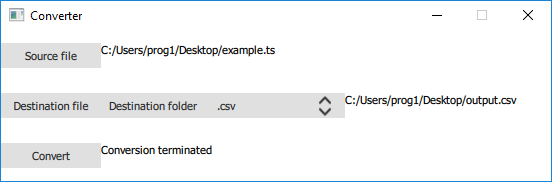
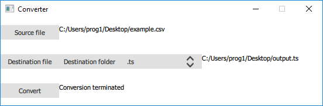
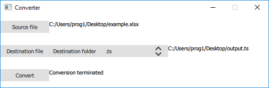

# qt-ts-csv
A tool to generate csv and xlsx file from qt ts file and vice versa

## Build
I used qmake systems and QtCreator as IDE.  
* The build directory have to be on the same lavel as the repo one.
The build directoy have to be named "build-qt-ts-csv".  
* It's is required the usage og windoeplyqt (read below)

## Usage
## To generate output.csv  
  
### To generate output.xlsx  
  
### To generate output.ts  
  
  
### How to use windeployqt  
```
your\path\to\your\windeployqt\in\your\qt\compiler\bin\windeployqt.exe --qmldir your\path\to\qt-ts-csv\src your\path\to\build-qt-ts-csv\src\release  
```
Example:  
```
C:\Qt\5.12.1\mingw73_64\bin\windeployqt.exe --qmldir C:\Users\prog1\Desktop\qt-ts-csv\src C:\Users\prog1\Desktop\build-qt-ts-csv\src\release  
```
